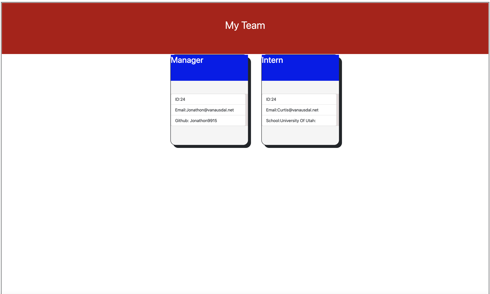

## Team Profile Generator

## Discription:
* Team Profile Generator allows a user to generate and create a team of employees! just fill out the prompts. 

## Table of Contents 
- [Installation](#installation)
- [Usage](#usage)
- [Credits](#credits)
- [License](#license)

## Installation:
- run node index.js and fill out the prompted questions. 

## Usage:
Add a screenshot, create an `assets/images` folder in your repository and upload your screenshot to it. Then, using the relative filepath, add it to your README using the following syntax: !'[alt text](assets/images/screenshot.png)'
screenshot: 

## Credits:
* Collaborators: n/a
* Assets: n/a
* Tutorials: youtube.com
* Features: n/a
## Links:
* Github link: https://github.com/jonathonvanausdal9915
* video link:
